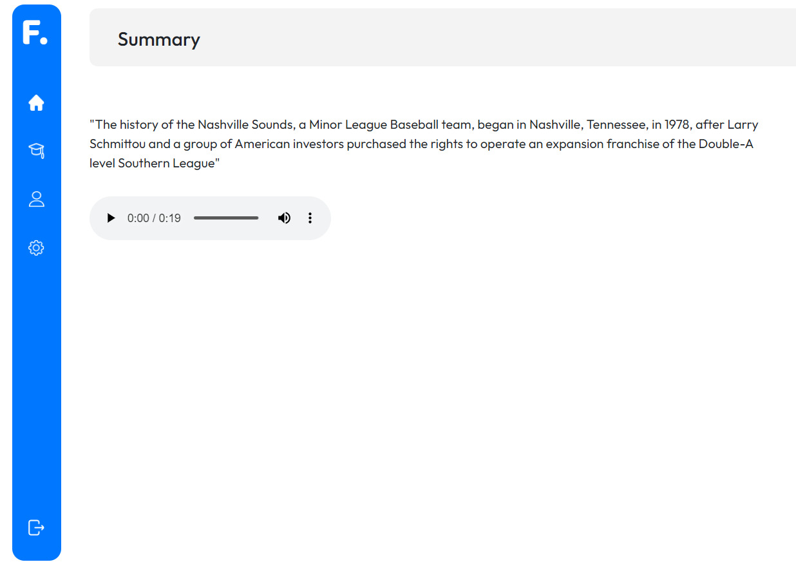

# Horus

       Making Remote Work truly healthy and productive option

# Project Demo

####                                Click on the image above to watch the demo

# Instructions to run application:

      1. Create a python 3.7 virtual environment and proceeed with installation there:
      
      2. Clone this repository cd to folder and install the modules in requirements.txt and run
           pip install -r requirements.txt.

      3. To run this project, Open command prompt type 

      4. cd Horus
 
      5. Type python manage.py migrate and then python manage.py runserver
      
      6. You Can See The Website Live in  http://127.0.0.1:8000/
      
      7. Create a new account at the sign up page and avail the services.
                      
# Motivation for the project:

With the change in the working environment across the globe, HR teams continuously strive to provide the best work-from-home setup.

Remote work has become the new norm because of the pandemic and after 2 years of it, many companies have actually decided to integrate itpermanently into their work culture because of it’s advantages. But it also has a lot of negative effects like difficulty to collaborate, degrading mental health, reduced work life balance, low physical activity and zoom fatigue. Therefore we have created a product that can solve these issues.

# Solution 

Horus is a feature rich platform that can make remote work fesible for long term. While creating this, we have made sure that the employee’s mental and physical wellbeing is the top priority. We start wth this simple and user friendly dashboard that allows the employee to have a look at all his work for the week at a glance. Horus uses computer vision to track the emotions of employees through out the day and provides a summary on the HR dashboard. It will also remind to take break if it detects you are stressed and to look away form the screen if you have been staring for too long, drinking water, stretch and exercise a little, lunch break, sleep time. There is also an option for the HR to reward the user based on his performance. Since these are time based reminders, we are triggering them manually for this demo.

Aprt form this, we have a virtual assisstant that will help the employee if he is feeling stressed, it can also schedule zoom meetings and provide the link and password.

Our last feature is a meeting summarizer. Imagine you are very tired from all the work you did for the day but you still have one meeting left. With this feature, meetings can automatically be sumarrized base don their transcript form the zoom API. So now instead of watch the whole recording of meetings, you can simply read the short summary of it. For the purposes of demo, we are copying a random piece of text off of internet and summarizing it. So as you can see this the summarized text which is significantly smaller and easy to read. Or you can also listen to it.

 

# Tech stack and Modules used:

   <b> Website: </b> React , JS , HTML5 , CSS , SCSS
   
   <b> Media processing: </b> TensorFlow, OpenCV , NLP ,Pyaudio, Python, TF-IDF
   
   <b> Backend : </b> Flask
   
   <b> Database :  Astra DB with Cassandra Python Driver
  
# Implementing AI based Solution:

Modules and libraries used: Tensorflow 2.0, OpenCV, Dlib(deeplibrary)

  The AI-model problem can be broken down into  categories,
 

# Overview of Website:
       

 

